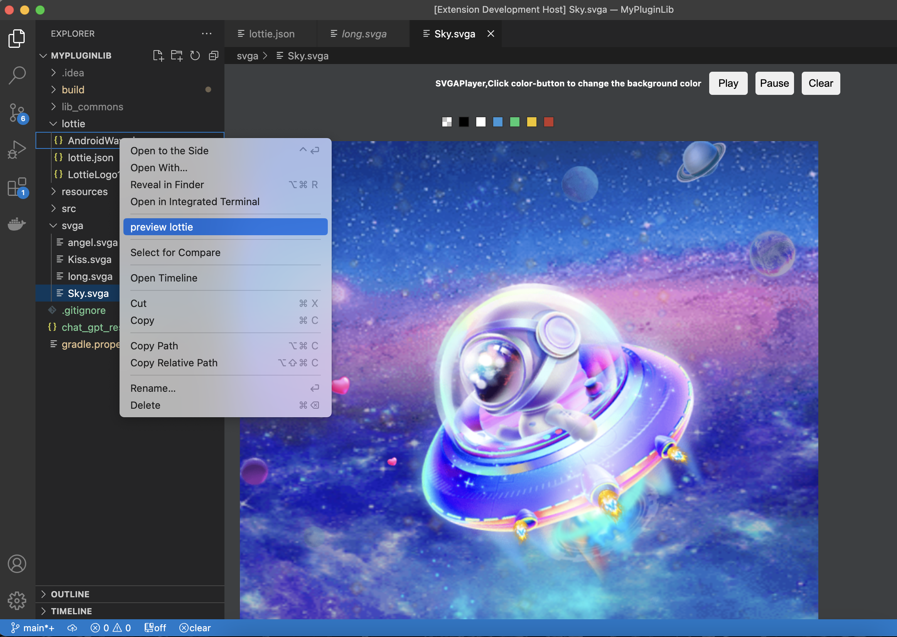
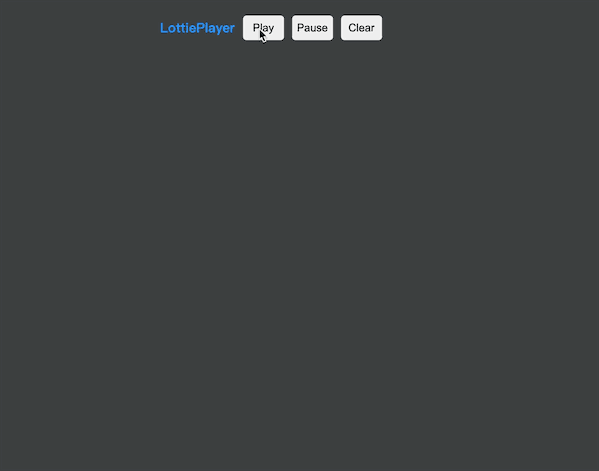
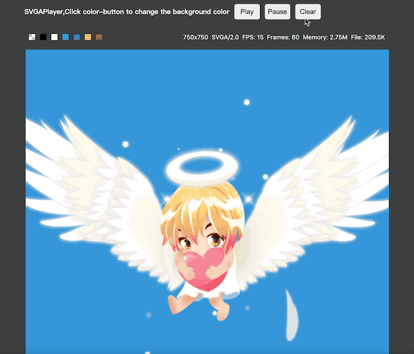

# DusanPlugin

Interesting plugins for developer.

lottie-svga-player can integrated into the IDE,it has Multiple platform version for Visual Studio Code,Android Studio and VS Code IDEA.

For IDEA/Android Studio：[Lottie_SVGA_AndroidTools](https://plugins.jetbrains.com/plugin/20039-lottie-svga-androidtools?preview=true)
For VSCode：[lottie-svga-player](https://marketplace.visualstudio.com/items?itemName=duqian3201.lottie-svga-player)

Project Repository:[https://github.com/duqian291902259/DusanPlugin](https://github.com/duqian291902259/DusanPlugin)

## 1. lottie-svga-player

1. Install by Visual Studio Code.
1. Select .svga or lottie .json file -> Preview SVGA/Lottie.
1. Drog .svga to vscode to play or preview lottie json by right menus

### Functions

1. Lottie-Player.
1. SVGA-Player.
1. ChatGPT plugin.
1. Plugin-in for Developer.
1. And so on...

### Plugin Screenshots

### Download
1.Download plugin from marketplace by search 'lottie-svga-player' or 'duqian' to install it.

##### Drag into the IDE and install it to take effect directly.

## Others
There are more tools to dev. To get more info,please contact me:

1. Email:duqian2010@gmail.com 
2. wechat:AndroidDQ
